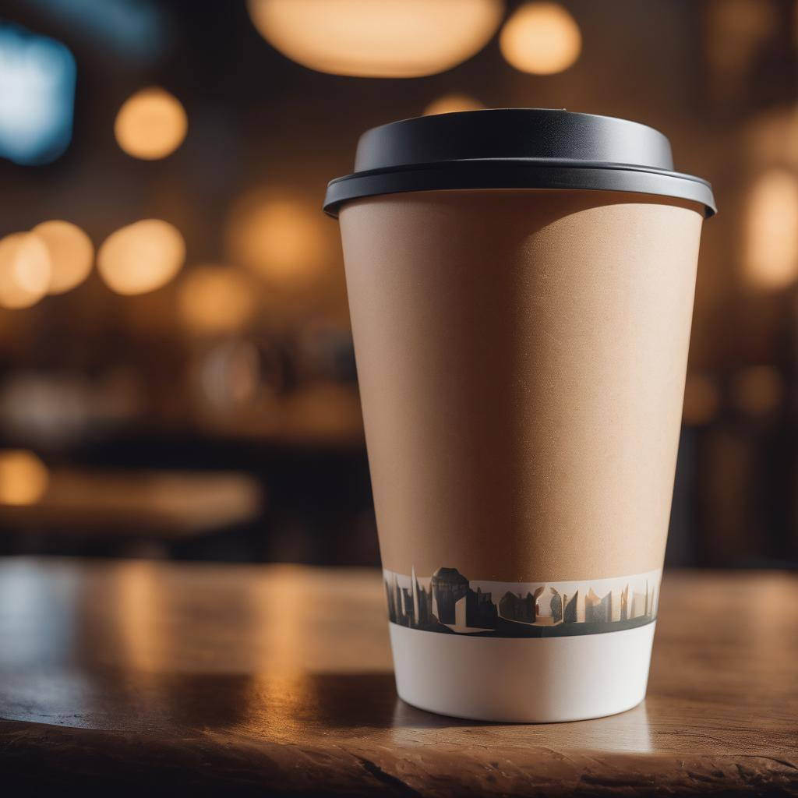

## Project Description

Cozy Cup Cafe is a haven for those seeking a warm and inviting atmosphere to enjoy delicious coffee, delectable treats, and friendly conversation. More than just a cafe, it aims to be a community hub where people can connect, relax, and recharge.

## Features

**Ambiance:**

* Warm and inviting color palette
* Plush seating and comfortable furniture
* Abundant natural light
* Exposed brick walls (optional)
* Cozy armchairs and couches
* Hanging plants and greenery
* Communal tables for interaction
* Dedicated events space
* Local artwork and handcrafted furniture
* Fair-trade coffee beans
* Soft background music

**Menu:**

* High-quality coffee beans and blends
* Single-origin coffee options
* Creative coffee concoctions and seasonal specials
* Freshly baked pastries, cakes, and breads
* Homemade sandwiches, wraps, and salads
* Healthy and light lunch options
* Locally sourced ingredients
* Variety of milk alternatives (oat, almond, soy)
* Vegan and gluten-free options available (optional)

**Community and Events:**

* Open mic nights
* Live music performances
* Board game nights
* Book clubs and reading groups
* Local artist showcases
* Collaboration with community organizations
* Regular events calendar

**Technology:**

* Free Wi-Fi for remote workers and students
* Charging stations for laptops and phones
* Online ordering and delivery (optional)

## Screen Captures

Start your morning right with a steaming cup of coffee!

Sip, savor, and let the rich aroma awaken your senses

Indulge in the simple pleasure of a perfectly brewed cup of coffee!

Elevate your coffee experience with this picture-perfect scene!

## About the Authors

